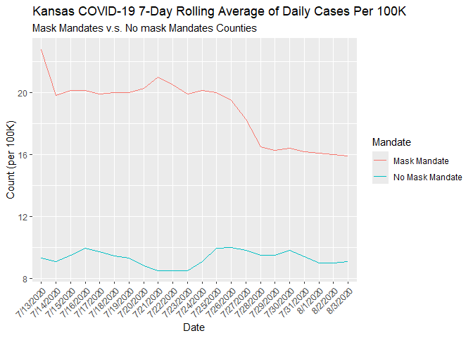
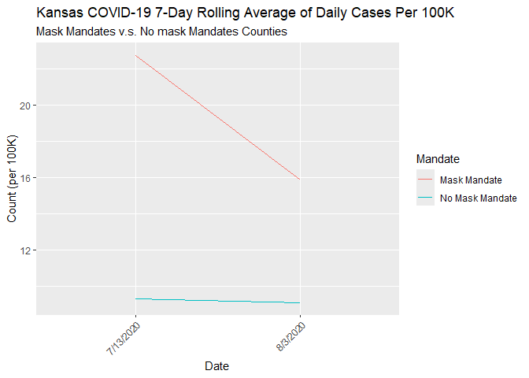
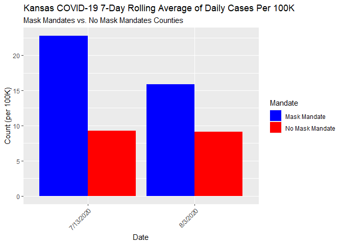

Lab 07 - Conveying the right message through visualisation
================
Hannah Crawley
3/3/25

### Load packages and data

``` r
library(tidyverse) 
```

### Exercise 1

> Create a data frame that can be used to re-construct this
> visualization. You may need to guess some of the numbers, that’s ok.
> You should first think about how many rows and columns you’ll need and
> what you want to call your variables. Then, you can use the tribble()
> function for this. For example, if you wanted to construct the
> following data frame?

``` r
covid <- tribble(
  ~date, ~count, ~mandate,
  "7/13/2020", 22.75, "mask", 
  "7/14/2020", 19.8, "mask",
  "7/15/2020", 20.1, "mask",  
  "7/16/2020", 20.1, "mask", 
  "7/17/2020", 19.9, "mask",
  "7/18/2020", 20, "mask", 
  "7/19/2020", 20, "mask",
  "7/20/2020", 20.25, "mask",  
  "7/21/2020", 21, "mask", 
  "7/22/2020", 20.5, "mask",
  "7/23/2020", 19.9, "mask", 
  "7/24/2020", 20.1, "mask",
  "7/25/2020", 20, "mask",  
  "7/26/2020", 19.5, "mask", 
  "7/27/2020", 18.25, "mask",
  "7/28/2020", 16.5, "mask", 
  "7/29/2020", 16.25, "mask",
  "7/30/2020", 16.4, "mask",  
  "7/31/2020", 16.15, "mask", 
  "8/1/2020", 16.1, "mask",
  "8/2/2020", 16, "mask", 
  "8/3/2020", 15.9, "mask",  
  "7/13/2020", 9.3, "nomask", 
  "7/14/2020", 9.1, "nomask",
  "7/15/2020", 9.5, "nomask",  
  "7/16/2020", 9.95, "nomask", 
  "7/17/2020", 9.7, "nomask",
  "7/18/2020", 9.45, "nomask", 
  "7/19/2020", 9.3, "nomask",
  "7/20/2020", 8.8, "nomask",  
  "7/21/2020", 8.5, "nomask", 
  "7/22/2020", 8.5, "nomask",
  "7/23/2020", 8.5, "nomask", 
  "7/24/2020", 9.1, "nomask",
  "7/25/2020", 9.95, "nomask",  
  "7/26/2020", 10, "nomask", 
  "7/27/2020", 9.8, "nomask",
  "7/28/2020", 9.5, "nomask", 
  "7/29/2020", 9.5, "nomask",
  "7/30/2020", 9.8, "nomask",  
  "7/31/2020", 9.4, "nomask", 
  "8/1/2020", 9, "nomask",
  "8/2/2020", 9, "nomask", 
  "8/3/2020", 9.1, "nomask"
)
```

### Exercise 2

> Make a visualization that more accurately (and honestly) reflects the
> data and conveys a clear message.

``` r
library(ggplot2)
```

``` r
ggplot(covid, aes(x = date, y = count, group = mandate, color = mandate)) +
  geom_line() + 
  labs(title = "Kansas COVID-19 7-Day Rolling Average of Daily Cases Per 100K", subtitle = "Mask Mandates v.s. No mask Mandates Counties", y = "Count (per 100K)", x ="Date", color = "Mandate", mask = "Mask Mandates", nomask = "No Mask Mandates") +   
  theme(axis.text.x = element_text(angle = 45, hjust = 1)) + 
    scale_color_discrete(labels = c("mask" = "Mask Mandate", "nomask" = "No Mask Mandate"))
```

<!-- -->

### Exercise 3

> What message is more clear in your visualization than it was in the
> original visualization?

- Counties with mask mandates have higher average daily cases of covid
  than counties without mask mandates

### Exercise 4

> What, if any, useful information do these data and your visualization
> tell us about mask wearing and COVID? It’ll be difficult to set aside
> what you already know about mask wearing, but you should try to focus
> only on what this visualization tells. Feel free to also comment on
> whether that lines up with what you know about mask wearing.

- This would suggest that mask mandates are not useful in preventing the
  spread of covid as the counties with no mask mandates have much lower
  rates of covid. However, the mask mandate counties show a decrease in
  covid cases from the initial rate whereas the no mask mandate counties
  show persistence of covid.

### Exercise 5

> Reflect on the message conveyed by your accurate visualization
> regarding mask-wearing and COVID-19. Discuss the key factors that
> contribute to this message, such as the variables used, the scale of
> the axes, and the type of visualization.

- Scaling of the y-axis makes it clear to tell the differences in these
  two groups  
- There are differences in the starting levels of covid  
- Other confounding factors such as population density may play a large
  role in these results (e.g., urban vs rural areas)  
- there are other plots that may be more useful such as percent change,
  dot plots, bar plots comparing rates before and after mandates

### Exercise 6

> Plan Your Opposite Visualization: Briefly determine what opposite
> message you want to covey. Consider the data you have available (or
> could easily add).

- If you do not have critical consumers of information - you could
  easily make the case that mask mandates are not helpful in stopping
  the spreat of covid. But with the right visualization you could show
  that masks really do help.

### Exercise 7

> Use visualization techniques to craft a chart or graph that conveys
> this contrary perspective. Pay careful attention to how different
> visualization choices, like altering the y-axis scale or changing the
> chart type, can influence the message received by the audience.

- according to google - mask mandates began in Kansas in early July
  (July 3)  
- I am going to consider the first data point as the “beginning of mask
  mandates”

``` r
covidnew <- tribble(
  ~date, ~count, ~mandate,
  "7/13/2020", 22.75, "mask", 
  "8/3/2020", 15.9, "mask",  
  "7/13/2020", 9.3, "nomask", 
  "8/3/2020", 9.1, "nomask"
)
```

``` r
ggplot(covidnew, aes(x = date, y = count, group = mandate, color = mandate)) +
  geom_line() + 
  labs(title = "Kansas COVID-19 7-Day Rolling Average of Daily Cases Per 100K", subtitle = "Mask Mandates v.s. No mask Mandates Counties", y = "Count (per 100K)", x ="Date", color = "Mandate", mask = "Mask Mandates", nomask = "No Mask Mandates") +   
  theme(axis.text.x = element_text(angle = 45, hjust = 1)) + 
    scale_color_discrete(labels = c("mask" = "Mask Mandate", "nomask" = "No Mask Mandate"))
```

<!-- -->

- This certainly shows that there is a decrease in the number of cases
  in mask mandate counties - to go further you could even remove the no
  mandate counties

``` r
ggplot(covidnew, aes(x = date, y = count, fill = mandate)) +
  geom_bar(stat = "identity", position = "dodge") +  # Use stat="identity" for the summarized data
  labs(
    title = "Kansas COVID-19 7-Day Rolling Average of Daily Cases Per 100K", 
    subtitle = "Mask Mandates vs. No Mask Mandates Counties", 
    y = "Count (per 100K)", 
    x = "Date", 
    color = "Mandate",fill = "Mandate" 
  ) +   
  theme(axis.text.x = element_text(angle = 45, hjust = 1)) + 
  scale_fill_manual(
    values = c("mask" = "blue", "nomask" = "red"),
    labels = c("mask" = "Mask Mandate", "nomask" = "No Mask Mandate")
  )
```

<!-- -->
